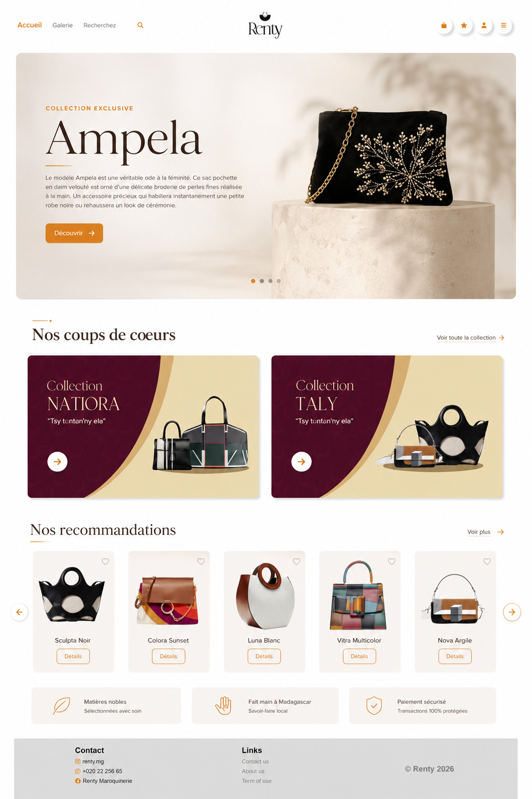
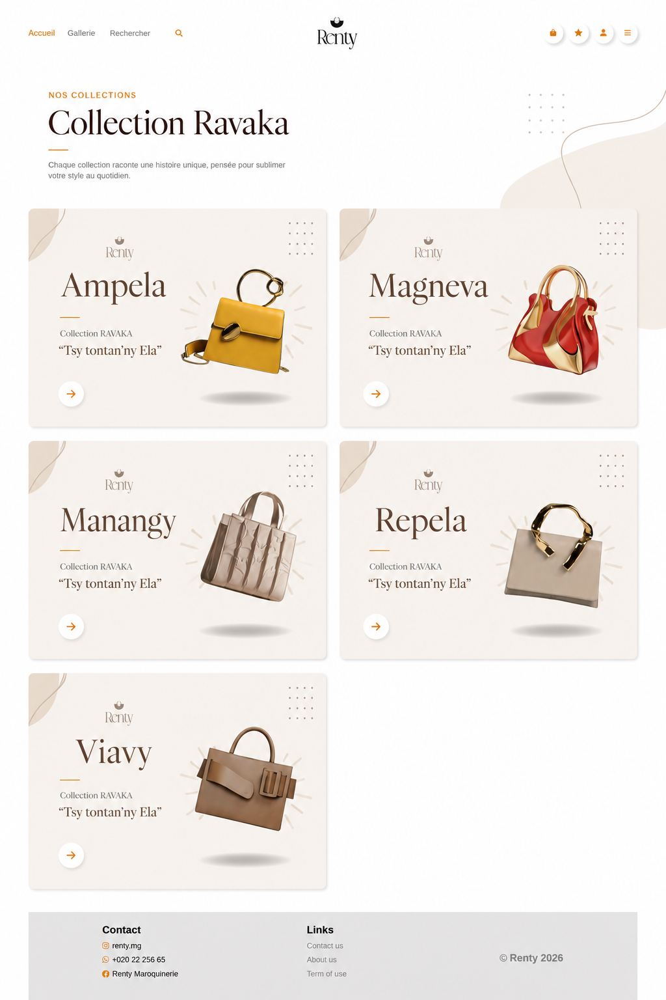
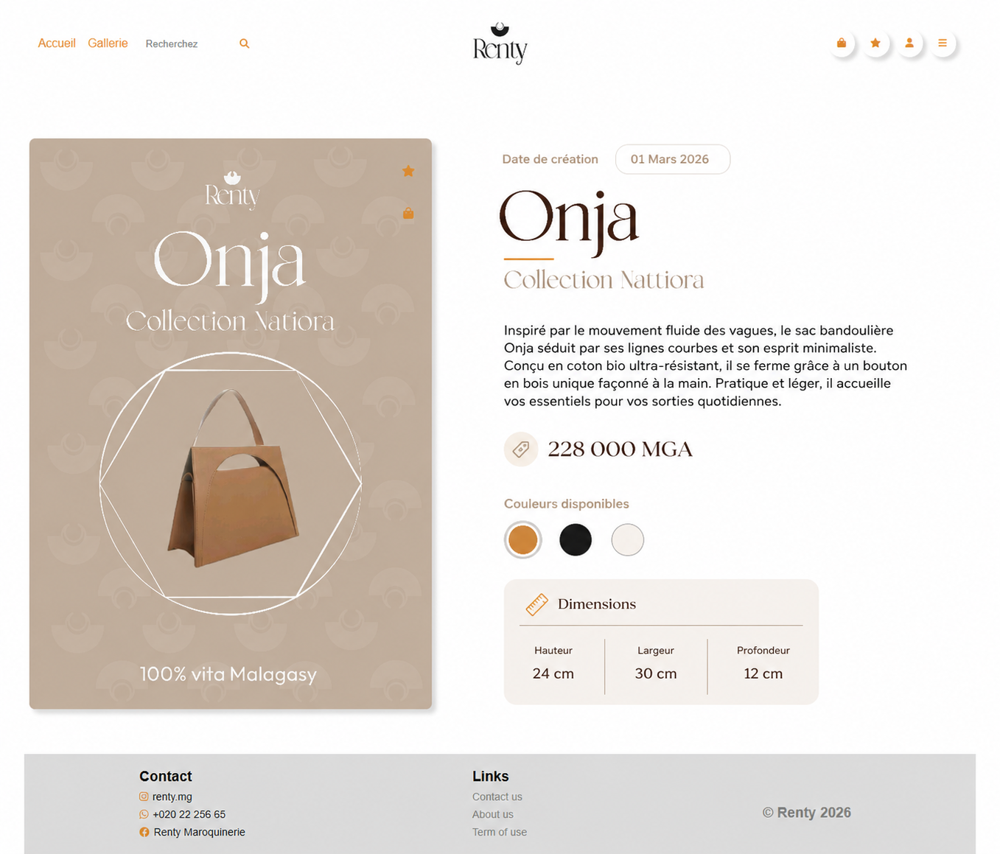

# Renty 

Renty est une **boutique e-commerce** dédiée à la vente de sacs artisanaux et premium, mettant en avant des collections uniques alliant **qualité**, **design** et **authenticité**.

La plateforme a été développée avec le framework **CodeIgniter 4** en respectant une architecture **MVC complète**, allant de la gestion des produits jusqu’au système de **commande** et d’**administration**.

## ✨ Fonctionnalités

- 🛍️ Catalogue de produits organisé par **collections**
- 🔎 Système de filtrage **avancé** (collections, dimensions, matériaux)
- 🛒 Panier d’**achat** et processus de commande
- 🧾 Gestion complète des **commandes**
- 📦 Gestion des **stocks** via interface d’administration
- 📧 Envoi d’e-mails automatiques (confirmation et suivi de commande avec **PHPMailer**)
- 👨‍💼 Back-office complet (**CRUD** produits, commandes, stock)
- 📱 Interface **responsive** adaptée à tous les supports

## 🛠️ Stack Technique

- **PHP 8.2**
- **CodeIgniter 4 (architecture MVC)**
- **MySQL**
- **JavaScript (ES6)**
- **Bootstrap 5**
- **PHPMailer**

## 🎯 Objectif du Projet

Renty a été conçu comme une véritable **boutique en ligne fonctionnelle**, simulant un cas réel de commerce digital.

Le projet vise à mettre en œuvre :
- Une architecture **MVC propre et maintenable**
- Une gestion structurée des **données produits**
- Un système de **commande complet**
- Une expérience utilisateur **fluide et moderne**
- Une logique métier proche d’une **application réelle**

## 🧠 Points Techniques Importants

- Architecture **MVC complète** avec CodeIgniter 4
- Modélisation d’une **base de données relationnelle pour e-commerce**
- Système de **commande structuré et sécurisé**
- Back-office pour la gestion des **produits et des stocks**
- Automatisation des **emails clients** (confirmation et suivi)
- Interface optimisée pour l’**expérience utilisateur** et la **conversion**

## 📸 Screenshots

### Accueil

### Collection

### Catalogue

## 🔮 Améliorations futures

- Intégration d’un système de **paiement en ligne** (Stripe / PayPal)
- Système de **recommandations produits**
- Gestion **multi-vendeurs**
- Suivi de commande côté client
- Tableau de bord **analytique** pour l’administration

## 👩‍💻 Auteur
**Voarisoa Marinah**

Passionnée par la création d’applications **modernes**, **scalables** et **intuitives**, alliant développement logiciel et expérience utilisateur.
